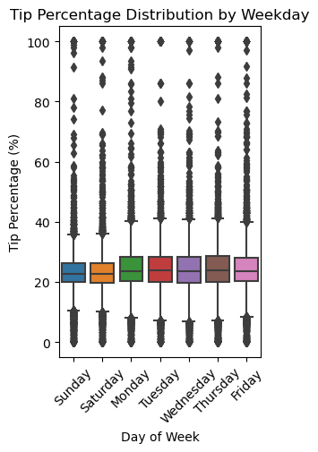
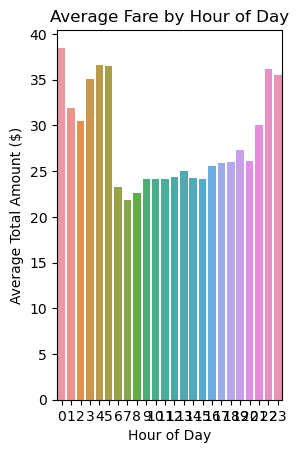
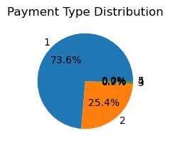
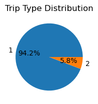
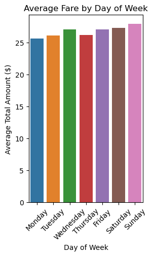
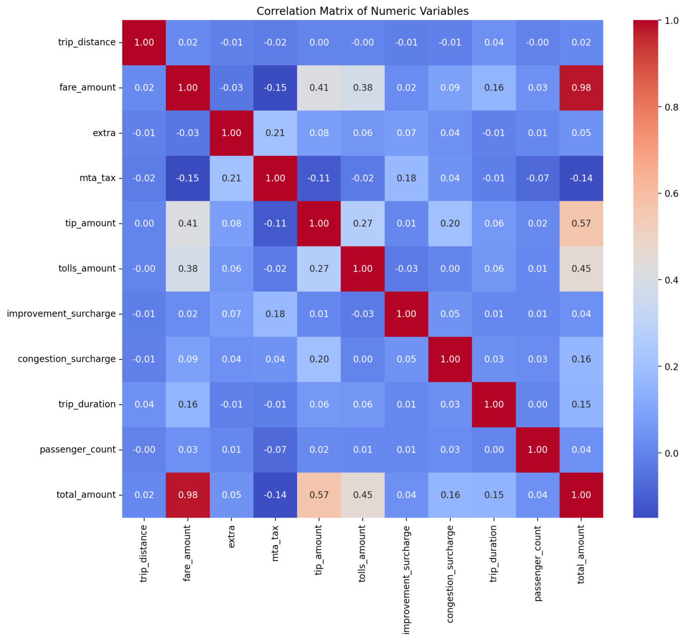

# NYC Green Taxi Analysis 🚖

A **Streamlit** application to analyze NYC Green Taxi trip data, build fare prediction models, and estimate total amounts interactively.

---

## 🔍 Overview

The app includes:

- **Data Analysis**: Visualize trends, perform statistical analysis  
- **Model Building**: Train & compare ML models to predict fare amounts  
- **Prediction**: Estimate total fare using trip input parameters

---


## ⚙️ Installation

### Requirements
- Python 3.7+
- pip

### Setup
```bash
git clone https://github.com/yourusername/nyc-green-taxi-analysis.git
cd nyc-green-taxi-analysis
python -m venv venv
source venv/bin/activate  # or venv\Scripts\activate on Windows
pip install -r requirements.txt
streamlit run nyc_green_taxi_app.py
````

---

## 📊 Features

* Interactive charts & plots
* ANOVA & Chi-square statistical tests
* ML models: Linear, Decision Tree, Random Forest, Gradient Boosting
* Feature importance insights
* Real-time fare prediction with user inputs

---

## 🧠 Model Performance

| Model             | RMSE      | R² Score  |
| ----------------- | --------- | --------- |
| Linear Regression | \~2.5–4.0 | 0.85–0.95 |
| Random Forest     | \~1.5–3.0 | 0.90–0.97 |
| Gradient Boosting | \~1.5–2.8 | 0.91–0.98 |

Trained using an 80/20 train-test split.
Top features: trip distance, duration, time, passengers.

---

#### Key Visualizations in Data Analysis

The application provides the following visualizations in the Data Analysis tab:

## 📊 Key Visualizations

<table>
  <tr>
    <td></td>
    <td></td>
    <td></td>
  </tr>
  <tr>
    <td></td>
    <td></td>
    <td></td>
  </tr>
</table>


## 🗂️ Expected Data Format

CSV file with columns such as:

* `lpep_pickup_datetime`, `lpep_dropoff_datetime`
* `trip_distance`, `fare_amount`, `tip_amount`, `total_amount`
* `payment_type`, `trip_type`, `passenger_count`, etc.

Sample:
👉 [NYC TLC Trip Records](https://www1.nyc.gov/site/tlc/about/tlc-trip-record-data.page)

---

## 🚀 How to Use

1. Upload dataset in the **Data Analysis** tab
2. Build & compare models in **Model Building**
3. Estimate fare in **Prediction** tab

---

## 📦 Dependencies

* `streamlit`
* `pandas`, `numpy`
* `matplotlib`, `seaborn`
* `scikit-learn`, `scipy`

---

## 👤 Author

**G Pragnya Reddy**
📧 [gpragnyareddy1594@gmail.com](mailto:gpragnyareddy1594@gmail.com)

---

```
